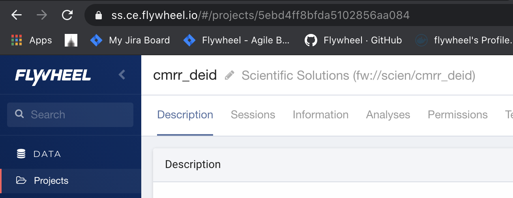

The first thing you may want to do is locate data in flywheel. There are a number of ways to find and view data on flywheel. The most basic way is to have the client return all containers of a certain type:

[Groups](#h_01ENNYJ1Q2YK5SHWJA5TCHYP4B)
=======================================

[View All Groups](#h_01ENNYJ9448DE6184GVHSCM6JN)
------------------------------------------------

To view all the groups your account has access to on this flywheel instance:
```python
all_groups = fw.groups()

print('Flywheel Groups:')
for group in all_groups:
    print(f"\t{group.id}")
```
 
-

[Find a Specific Group](#h_01ENNYJM0G9YTVG6HDBD4A84KM)
------------------------------------------------------

If you would like to examine a specific group in more detail, you can directly load that one group with the following:
```python
    group_name = 'scien'

    group = fw.get(group_name)
    # Equivalently, but possibly slower:
    group = fw.lookup(group_name)
    group = fw.groups.find(f"_id={group_id}")
```
####  

[The Group Object](#h_01ENNYK2Y9VSE3WFPF1B90MEAH)
-------------------------------------------------

The object returned by these finder functions is a python dictionary with a number of keys:

-   \_id: the group ID, same as label

-   label: The group label, same as ID

-   permissions\_template: A template of default permissions to give new projects

-   roles: Any roles the current API key has in the group

-   permissions: A list of users in the group and their assigned roles/permissions

-   created: When the group was created

-   modified: When the group was last modified

-   tags: Any user assigned tags

You can view the structure of this dictionary using pprint:
```python
pprint(group)
```
###  

[Projects](#h_01ENNYKJ2XGRK5EYPK16QJ8P8R)
=========================================

[View All Projects](#h_01ENNYM3EKS7BDSM1ZFH7KESG6)
--------------------------------------------------

To view all the projects your account has access to:
```python
projects = fw.projects()

print('Flywheel Projects:')
for project in projects:
        print(f"\t{project.label}")
```
### [View All Projects In a Group](#h_01ENNYMP8T27DGDKWVEXWAHQ0M)

#### [Using a Group ID](#h_01ENNYNB5TEGWJJJHDPTR78B80)

To view all projects in a specific group that your account has access to using a group id:
```python
group_id = 'scien'
projects_in_group = fw.projects.find(f"group={group_id}")

print(f"Flywheel Projects in {group_id}:")
for project in projects_in_group:
        print(f"\t{project.label}")
```
The flywheel finder `.find()` can be usd to search for values in the [Project Object Metadata](#project-object-metadata). Only keywords found in the object can be used in the query. More details on flywheel finders can be found here [LLL].

#### [Using a Group’s Project List](#h_01ENNYSAMWZ2GR22HDG20EJSQ9)

If you have already captured a group object (See [Find a Specific Group](#find-a-specific-group)), you can call `projects()` to return all projects in that group:
```python
group_id = 'scien'
group = fw.get(group_id)

projects_in_group = group.projects()
print(f"Flywheel Projects in {group_id}:")
for project in projects_in_group:
        print(f"\t{project.label}")
```
[View One Specific Project](#h_01ENNYSXQM1S4WQH04NK1B6AGX)
----------------------------------------------------------

### [Using the Client Projects Finder](#h_01ENNYTH9NZ6E9M2H21WPKWGB3)

To view one specific project in a group using the project label and group ID:
```python
group_id = 'scien'
project_label = 'cmrr_deid'

one_project = fw.projects.find(f"group={group_id},label={project_label}")
# Or Equivalently:
one_project = fw.projects.find_first(f"group={group_id},label={project_label}")
one_project = fw.projects.find_one(f"group={group_id},label={project_label}")
one_project = fw.lookup(f"{group_id}/{project_label}")
```
The differences the finders/lookup functions are [covered in more detail here](https://flywheel-io.gitlab.io/product/backend/sdk/branches/master/python/getting_started.html#working-with-finders)

Note that if a group has multiple projects with the same name, it will be easier to access a project using it’s unique Flywheel ID. If you know a project’s flywheel ID, you can access it directly using the steps in the next section:

### [Using a Group’s Project Finder](#h_01ENNYSAMWZ2GR22HDG20EJSQ9)

If you already have the group object loaded that the project belongs to, it may be faster to locate the project using the `group.projects.find()` method:
```python
group_id = 'scien'
group = fw.get(group_id)

project_label = 'cmrr_deid'
one_project = group.projects.find(f"label={project_label})

# Or Equivalently:

one_project = group.projects.find_first(f"label={project_label})
one_project = group.projects.find_one(f"label={project_label})
```
### [Get a Project’s Flywheel ID](#h_01ENNYW70XWSN32BT8CYYH1XY4)

Flywheel assigns unique IDs to every [object](https://flywheel-io.gitlab.io/product/backend/sdk/branches/master/python/data_model.html). This ID can be useful for looking up data, as a single group can have multiple projects with the same name, but the ID will always be unique. The project ID is stored in the [Project Object Metadata](#project-object-metadata), and can be accessed in the following way:
```python
group_id = 'scien'
project_label = 'cmrr_deid'

one_project = fw.lookup(f"{group_id}/{project_label}")

project_id = one_project.id

..
```
This ID can also be found in the hyperlink shown in your browser’s navigation bar when viewing that project on flywheel:



While the “finder” and “lookup” methods need to query flywheel for a project label, you can use the flywheel ID to directly retrieve a project, making this the fastest option for accessing data:
```python
    project = fw.get(project_id)
```
You can use the `fw.get()` method for Projects, Subjects, Sessions, and Acquisitions [LLL]

#### The Project Object[¶](#the-project-object "Permalink to this headline")

The project object (Say that ten times fast!) is a python dictionary. These are the most common key/value pairs you’ll likely use:

-   label: The project label

-   info: A dictionary representing any metadata information added to the project by users

-   description: A description of the project

-   group: The group to which the project belongs

-   \_id: The project ID, given as a unique flywheel letter/number identification string

-   parents: Any parent objects to the container. For projects, this is only the group

-   created: The date which the project was created

-   modified: The date which the project was last modified

-   permissions: A list of users who have access to this project, and their permissions

-   files: A list of any non-acquisition file attached to the project

-   tags: Any tags added to the project

-   analyses: A list of any project-level analyses

Note that the `info`, `files`, and `analyses` fields can be very long, depending on the number of items in each.

[Subjects](#h_01ENNYXZBZWNJZDRXZ1ZXFYTHP)
=========================================

[Finding All Subjects in a Project](#h_01ENNYYH7T3MK0SXQE2GTA3V3E)
------------------------------------------------------------------

### [Using a project’s subject list](#h_01ENNYZG17Q1B4H1WY8P8ZNGT7)

To view all subjects in a specific project we use the project ID to get the project object, as it contains information on all subjects within itself. If you have the project object, or know the project ID, you can print all subjects within the project as follows:
```python
    project_id = '5ebd4ff8bfda5102856aa084'
    project = fw.get(project_id)

    subjects_in_project = project.subjects()
    print(f"{len(subjects_in_project)} Subjects found")
    for subject in subjects_in_project:
          print(f"\t{subject.label}")
```
A project may also have a large number of subjects, so it may be desirable to use the subject iterator to loop through them to save on time waiting for the API to respond:
```python
project_id = '5ebd4ff8bfda5102856aa084'
project = fw.get(project_id)

subjects_in_project = project.subjects.iter()
print(f"{len(subjects_in_project)} Subjects found")
for subject in subjects_in_project:
        print(f"\t{subject.label}")
```
[View All Subjects in a Project That Meet Filter Criteria](#h_01ENNYZXZSRDPFCHNY8QWDRWHT)
-----------------------------------------------------------------------------------------

You can use the Flywheel finders to search for subjects with specific metadata values. For example, you can search for all male subjects under the age of 30:
```python
project_id = '5ebd4ff8bfda5102856aa084'
project = fw.get(project_id)

subjects_in_project = project.subjects.find("age<30,sex=male")
print(f"{len(subjects_in_project)} Subjects found")
for subject in subjects_in_project:
        print(f"\t{subject.label}")
```
If the subject has a custom metadata field in the “info” section, that too can be used with flywheel finders. For example:
```python
subjects_in_project = project.subjects.find("info.custom_info_field=<desired_value>")
```
[View one subject in a Project](#h_01ENNZ0DJYCH2S4VW234WFCASZ)
--------------------------------------------------------------

### [Using a Project’s Subject Finder](#h_01ENNZ10ACYSPVBJX4ES74NHBY)

Or if you have the project object, you can query that, using only the desired subject label:
```python
project_id = '5ebd4ff8bfda5102856aa084'
project = fw.get(project_id)

subject_label = 'ExampleSubject'
subject_in_project = project.subjects.find(f"label={subject_label}")
```
[The Subject Object](#h_01ENNZ1HSSW6JQVBNYT526ZJJW)
===================================================

-   \_id: The subject ID

-   project: The unique Flywheel ID of the parent project

-   firstname: The subject’s first name

-   lastname: The subject’s last name

-   sex: The subject’s sex

-   cohort: The cohort the subject belongs to

-   type: The type of subject (“Human”, “Animal”, or “Phantom”)

-   race: The subject’s race

-   ethnicity: The subject’s ethnicity

-   species: The subject’s species

-   strain: The subject’s strain

-   label: The subject’s label in flywheel

-   tags: Any tags added to the subject

-   info: Custom metadata added to the subject

-   files: Non-acquisition/image files attached to a subject

-   parents: The subject’s parent containers in flywheel

-   created: The date the subject was created

-   modified: The date the subject was last modified

-   permissions: A list of users who have access to this subject and their permissions

-   notes: Any notes added to the subject

-   analyses: Any analyses attached to the Subject container.

[Sessions](#h_01ENNZ23VCSMNZDDVZB6DSDGP1)
=========================================

[View All Sessions in a Project](#h_01ENNZ2J6SYM1VMC14D9HP1N55)
---------------------------------------------------------------

### [Using a Project’s Session List](#h_01ENNZ30VYG7A2F8XTNQN2YDG1)

If you already have the project object, you can view all sessions in a specific project using the project’s session list:
```python
project_id = '5ebd4ff8bfda5102856aa084'
project = fw.get(project_id)

sessions_in_project = project.sessions()

print(f"Flywheel Sessions in {project_id}:")
for session in sessions_in_project:
        print(f"\t{session.label}")
```
to call the iterator from the project:
```python
project_id = '5ebd4ff8bfda5102856aa084'
project = fw.get(project_id)

sessions_in_project_iterator = project.sessions.iter()

print(f"Flywheel Sessions in {project_id}:")
for session in sessions_in_project_iterator:
        print(f"\t{session.label}")
```
[View all Sessions for one Subject](#h_01ENNZ45751F820TFN8EP1A2XY)
------------------------------------------------------------------

### [Using a Subject’s Session List](#h_01ENNZ4KHA1XYZR36EX2ZQHDS8)

If you already have the subject object, you can get the sessions as follows:
```python
subject_id = '5ebd50b5bfda5102996aa0e5'
subject = fw.get(subject_id)
subject_sessions = subject.sessions()
```
[View all Sessions in a project with a specific key](#h_01ENNZ536KZA47JA8ZYKRN22HR)
-----------------------------------------------------------------------------------

It’s sometimes useful to retrieve all sessions of a certain type (‘Baseline’, or ‘Resting’). If this in formation is stored in the session label, it can easily be retrieved as follows:
```python
project_id = '5ebd4ff8bfda5102856aa084'
project = fw.get(project_id)

sessions = project.sessions.find("label=baseline")
print(f"{len(sessions)} Sessions Found:")
for ses in sessions:
    print(f"\t{ses.label})
```
Regular expressions can also be used with the `=~` symbol, in case for some reason each subject has a slightly different session name, but that always fits a pattern.

For example, assume that every subject has two resting state scans, each performed in a different session:

|Session Names:|
|:-------------|
|resting-baseline|
|resting-followup|
|func-baseline|
|func-followup|

If we were only interested in all baseline sessions, we could perform the following search:
```python
project_id = '5ebd4ff8bfda5102856aa084'
project = fw.get(project_id)

sessions = project.sessions.find("label=~.*baseline")
```
And if we only wanted resting state sessions, we could perform the following:
```python
project_id = '5ebd4ff8bfda5102856aa084'
project = fw.get(project_id)

sessions = project.sessions.find("label=~resting.*")
```
Read more about using finders [here](https://flywheel-io.gitlab.io/product/backend/sdk/branches/master/python/getting_started.html#working-with-finders).

[Getting One Session](#h_01ENNZ5TRJGB1GT3NWQ4P23Z8B)
----------------------------------------------------

### [From the Flywheel Instance URL](#h_01ENNZ698QZZFGSJ792DBJ0586)

A session ID can be found in the flywheel URL when in the “session” tab of a project, and in session view mode, as shown below:


The session can be loaded directly with `fw.get(session_id)`.

### [From a Subject’s Session Finder](#h_01ENNZ7XHJH1AKJ442A2W6XZY1)

In this example, because the subject is specified with its unique flywheel string, there is no need to specify the group and project - that information is stored within the subject.
```python
subject_id = '5efcdf14957ea0030bc8a8e7'
ses_label = 'Resting-baseline'
subject = fw.get(subject_id)

session = subject.sessions.find(f"label={ses_label}")
```
[The Session Object](#h_01ENNZ8B5MZJ0BN9NQA2BDTG8Q)
===================================================

-   label: The name of the session in Flyhweel

-   info: Any additional metadata information added to the session

-   project: The unique Flywheel ID of the project that this session belongs to

-   subject: The subject object (and it’s metadata) associated with the session

-   age: The age of the subject associated with the session

-   weight: The weight of the subject associated with the session

-   \_id: The unique Flywheel ID for this session

-   info\_exists: Indicates if there is any metadata in the “info” section

-   parents: The container’s parents object

-   created: The date/time that the Session was created in Flywheel

-   modified: The date/time that the Session was last modified in Flywheel

-   permissions: A list of users who have access to this session, and their associated permissions

-   group: The groupID associated with the session

-   files: A list of any files attached to the session that are not part of the child acquisitions

-   notes: Any notes added by users to the session

-   tags: Any tags added by users to the session

-   analyses: A list of any analysis containers associated with the session

-   acquisitions: A finder object with all the sessions’s acquisitions

[Acquisitions](#h_01ENNZ8QNCYT59NRHZFF2YWT0S)
=============================================

[View All Acquisitions in a Session](#h_01ENNZ94NBJW45G531285MVKKY)
-------------------------------------------------------------------

### [Using a Sessions’s Acquisition List](#h_01ENNZ9J7WR4VTKNQ6X8PDT50Y)

Each Session object has an “Acquisition” finder object with every acquisition for that session. To view all Acquisitions in a Session, use the following:
```python
session_id = '5efcdf14957ea0030bc8a8e7'
session = fw.get(session_id)
acquisitions = session.acquisitions()

print(f"{len(acquisitions)} acquisitions Found:")
for acq in acquisitions:
    print(f"\t{acq.label})
```
[Finding Specific Acquisitions](#h_01ENNZF6WGTEZY2DS51QZAD13X)
--------------------------------------------------------------

### [Using a Sessions’s Acquisition Finder](#h_01ENNZF6WGTEZY2DS51QZAD13X)

In Flywheel, the only container with an Acquisition finder is the Session container. A Session’s Acquisition Finder can be used to locate all acquisitions in that Session, or to filter them using the finder. For example, looking for any Acquisitions with the word “resting” in the label can be done as follows:
```python
session_id = '5efcdf14957ea0030bc8a8e7'
session = fw.get(session_id)
acquisitions = session.acquisitions.find('label=~.*resting.*')

print(f"{len(acquisitions)} acquisitions Found:")
for acq in acquisitions:
    print(f"\t{acq.label})
```
### [Using the Client’s Acquisition Finder](#h_01ENNZG1007J5H82G63NF6Q5AE)

The only other way to search for acquisitions is using the client’s finder. This can be useful if you want to find all acquisitions of a certain type in a project. For example, if you wanted to locate all acquisitions with the label “BOLD\_task\_checkerboard” in the project “checkerboard\_study”:
```python
project = fw.projects.find_one('label=checkerboard_study')
acquisition_label = "BOLD_task_checkerboard"
acquisitions = fw.acquisitions.find(f"parents.project={project.id},label={acquisition_label}')

print(f"{len(acquisitions)} acquisitions Found:")
for acq in acquisitions:
    print(f"\t{acq.label})
```
[Files](#h_01ENNZGE9Q91JPX6MFM6YEMW2C)
======================================

Every container, from Projects to Acquisitions, can have files attached to them. At the Acquisition level, these files are simply the actual scan files, and are displayed in flywheel under the acquisition. For the other containers, these files can be found under their “attachments” sections.

Files are stored in lists, and have no searchable finder objects associated with them.

[View All Files in an Acquisition](#h_01ENP0EA4VZZVMC4E13P9E2GAK)
-----------------------------------------------------------------

Because the project and session ID’s are readily available from the U.I., you’ll likely use these ID’s more than any other to find other containers. For example, to view all files in an acquisition, I would go through the session that the acquisition belongs to, since I can quickly copy and paste the session ID from the UI:
```python
session = fw.get('5efce8d7957ea00337c8a8ab')
acquisition = session.acquisitions.find_one('label=rfMRI_REST_AP_Run1')

print(f"acquisition {acquisition.label} has the following files:")
for acq_file in acquisition.files:
    print(f"\t{acq_file})
```
[Find One File in an Acquisition](#h_01ENP0EPD8MTCCS2H9B74VJ1S3)
----------------------------------------------------------------

Finding a file can be done quickly using list comprehension:
```python
file_name = 'rfMRI_REST_AP_12.nii.gz'
file = [f for f in acquisition.files if f.name==file_name]
```
File names must be unique, so this is guaranteed to only return one file. However, it’s still in a python list due to the structure of the call, so to return the file object itself we make one slight change:
```python
file_name = 'rfMRI_REST_AP_12.nii.gz'
file = [f for f in acquisition.files if f.name==file_name][0]
```
[Find All Files of A Certain Type](#h_01ENP0F6K0QGQZ9N0ZMSDRXS33)
-----------------------------------------------------------------

Typically, an acquisition will have one DICOM file, and a number of NIFTI files, depending on the type of scan and the amount of preprocessing being done. To find nifti files in an acquisition, the following search can be performed:
```python
filetype = 'nifti'
nifti_files = [f for f in acquisition.files if f.type==filetype]
```
Learn more about the supported [file types here](https://docs.flywheel.io/hc/en-us/articles/360037903734-File-Types-in-Flywheel).

Learn more about [working with files here](https://flywheel-io.gitlab.io/product/backend/sdk/branches/master/python/getting_started.html#dealing-with-files).

[Container Parents](#h_01ENP0FNFST0QTZQ482T88BPPJ)
==================================================

Every Flywheel container, except for groups, have a `parents` metadata field. The parents field has the following keys:

 - **acquisition**   
ID of the parent acquisition container

 - **analysis**   
ID of the parent analysis container

 - **group**   
ID of the parent group

 - **project**   
ID of the parent project

 - **session**   
ID of the parent session

 - **subject**   
ID of the parent subject

If there is no parent container for a given field, the value is `None`. For example, a flywheel project will have a parent group, but no parent acquisiton, analysis, session, or subject. This is determined by the flywheel container hierarchy [LLL]

 
