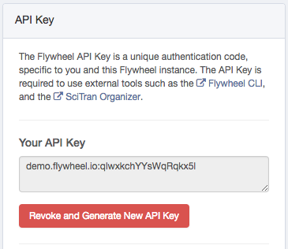
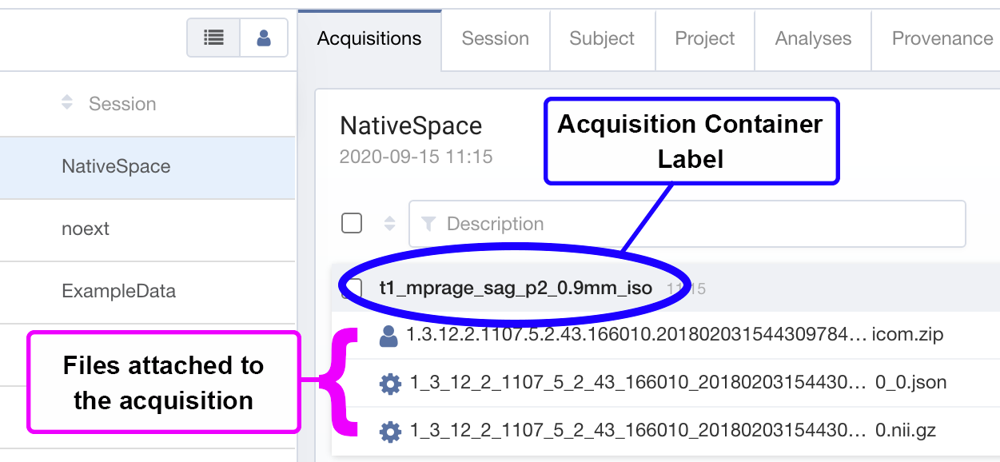
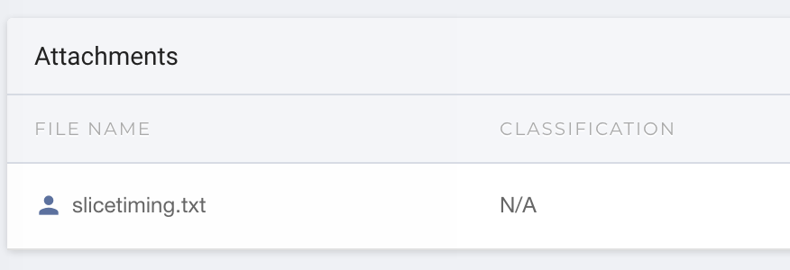

import Tabs from '@theme/Tabs';
import TabItem from '@theme/TabItem';

The Flywheel SDK is a python toolbox that provides programmatic access to the Flywheel API endpoints.

License
-------
Flywheel SDK has an MIT-based [license](https://github.com/flywheel-io/core/blob/master/LICENSE).

Installation
------------
<Tabs
  groupId="languages"
  defaultValue="python"
  values={[
    {label: 'Python', value: 'python'},
    {label: 'MATLAB', value: 'matlab'},
  ]}>
    <TabItem value="python">
The latest python package can be installed using pip:

```console   
$ pip install flywheel-sdk  
 ```
   </TabItem>
  
  <TabItem value="matlab">
  Click here to download the latest Matlab Toolbox: Download.

Installation can be done one of two ways, depending on your Operating System. For OSX and Windows you should be able to double-click the downloaded toolbox in order to perform the installation.

If your Operating System does not support double-click installation of toolboxes, you can install from within the matlab console.
```matlab
toolboxFile = '/path/to/flywheel-sdk-version.mltbx';
installedToolbox = matlab.addons.toolbox.installToolbox(toolboxFile)
```
</TabItem>
</Tabs>

API Key
-------
The SDK requires an API key. You can find and generate your key on the Flywheel profile page. It will look like this:



Making API Calls
----------------
In order to make API calls, you will need to connect to the flywheel Client. There are two primary ways to connect to your flywheel Client:

Connect using your CLI login
----------------------------
:::tip
If you have already installed the flywheel CLI, and have logged in ([as described here](https://docs.flywheel.io/hc/en-us/articles/360008162214-Installing-the-Command-Line-Interface-CLI-)), then you may access your instance’s API with the command `flywheel.Client()`, which will allow you to access your flywheel instance using the same login credentials and permissions associated with your current CLI session:
:::  
```python
import flywheel
from pprint import pprint

# Access the flywheel API
    fw = flywheel.Client()

# Check user Info
    user_info = fw.get_current_user()

    print (f”Firstname: {user_info.firstname} \n"
        f"Lastname: {user_info.lastname} \n"
        f"Email: {user_info.email}")
```

Connect using your API key
--------------------------
You can pass your API key directly into the `flywheel.Client()`command to log in using the account and credentials associated with that API key. This will override any CLI sessions. The flywheel API key is usually of the following format:

`<URL>:<numbers_and_letters>`

for example:

`instance.flywheel.io:a1b2c3d4e5f6g7h8i9j0k`

This string should be considered like a password, and should be kept secret.

You can log in to the instance associated with this key using the following code:

```python
import flywheel
from pprint import pprint

# Enter your API key into python and pass that
# value in when calling flywheel.Client()
api_key = "<MY_FLYWHEEL_API_KEY>"
fw = flywheel.Client(api_key)

# Check user Info
user_info = fw.get_current_user()

print(f"Firstname: {user_info.firstname} \n"
        f"Lastname: {user_info.lastname} \n"
        f"Email: {user_info.email}")
```
Fundamentals
============
Flywheel Organization
---------------------

In Flywheel, data is organized in “Containers”. Containers are essentially objects (as in, object-oriented programming kind of objects) that contain actual data files, as well as metadata and custom information about the container or files themselves.

There are 8 containers used in Flywheel: Five of them are primarily hierarchical containers used for organization of data:

1.  Group

2.  Project

3.  Subject

4.  Session

5.  Acquisition

In these five containers, the parent/child order is rigidly enforced. For example, a “Group” container cannot **directly** have an acquisition container attached as a child. Instead, it must have a “Project” child, which must have a “Subject” child, which must have a “Session” child, which then can have an “Acquisition” child.

In addition to these five containers, there are two “sub-containers” that can belong to most containers regardless of their level in the hierarchy.

1.  File

2.  Analysis

Finally, there is the last container, which is used to organize running tasks (gears) on the site:

1.  Job

Each container has its own metadata attributes associated with it. Some are shared across multiple (or all) containers, while others are unique to a specific container type.

Additionally, users can upload custom information to any container as a form of additional metadata fields.

Groups
-----
The <cite>Group</cite> Container has the following attributes:

*   providers
*   created
*   editions
*   permissions
*   _id
*   modified
*   tags
*   label  

Group containers cannot have Files, Analyses, or Jobs associated with them.

Group containers may have child Projects
<pre>Group1
 ├─ Project 1
 ├─ Project 2
 └─ Project 3
</pre>
Projects
--------
The **Project** Container has the following attributes
*   info

*   info_exists

*   group

*   description

*   templates

*   providers

*   notes

*   created

*   modified

*   label

*   tags

*   parents

*   editions

*   **analyses**

*   _id

*   public

*   **files**

*   permissions

:::tip
Note that analyses and files are attributes of the <cite>Project</cite> container.
:::

Project containers may have Files, and Analyses associated with them.

Project containers may have child Subjects:

<pre>
 ├─ [analyses]
 │    └─Analysis1
 │       ├─ Analysis File1
 │       └─ Analysis File2
 │
 ├─ [files]
 │    └─ Project File1
 ├─ Subject 1
 └─ Subject 2
</pre>
Subjects
--------
The **Subject** Container has the following attributes:

*   code

*   sex

*   strain

*   species

*   ethnicity

*   cohort

*   label

*   parents

*   type

*   master_code

*   files

*   info_exists

*   firstname

*   tags

*   lastname

*   analyses

*   permissions

*   info

*   created

*   age

*   modified

*   public

*   project

*   race

*   _id

*   notes

Note that analyses and files are attributes of the <cite>Subject</cite> container.

The “project” attribute is not referring to a “child” Project that belongs to the subject, it instead is a reference to the subject container’s parent project.

Subject containers may have child Sessions:
<pre>1
 ├─ [analyses]
 │    └─Analysis1
 │       ├─ Analysis File1
 │       └─ Analysis File2
 │
 ├─ [files]
 │    └─ Subject File1
 ├─ Session 1
 └─ Session 2
</pre>
Sessions
--------
The Session Container has the following attributes:

*   uid

*   weight

*   operator

*   timezone

*   project_has_template

*   group

*   label

*   parents

*   subject

*   public

*   files

*   info_exists

*   tags

*   timestamp

*   analyses

*   satisfies_template

*   permissions

*   info

*   created

*   age

*   modified

*   project

*   _id

*   notes

Note that analyses and files are attributes of the **Acquisition** container.

The “subject” attribute is not referring to a “child” Subject that belongs to the session, it instead is a reference to the sessions parent containers.

session containers may have child files:
<pre>1
 ├─ [analyses]
 │    └─Analysis1
 │       ├─ Analysis File1
 │       └─ Analysis File2
 │
 └─ [files]
 └─ Session File1
</pre>
Acquisitions
------------
The **Acquisition** Container has the following attributes:
*   info

*   files

*   uid

*   created

*   analyses

*   timestamp

*   notes

*   tags

*   collections

*   label

*   session

*   parents

*   modified

*   timezone

*   permissions

*   _id

*   public

*   info_exists

Note that analyses and files are attributes of the **Session** container.

The “subject” and “project” attributes are not referring to a “child” Project/Subject that belongs to the session, it instead is a reference to the sessions parent containers.

session containers may have child acquisitions:
<pre>
 ├─ [analyses]
 │    └─Analysis1
 │       ├─ Analysis File1
 │       └─ Analysis File2
 │
 ├─ [files]
 │    └─ Session File1
 ├─ Acquisition 1
 └─ Acquisition 2
</pre>
The files attached to anacquisition are the files that you actually see in flywheel on a typical session view:



For all other containers, “files” will appear under the “Attachments” category when viewing the container’s info:


